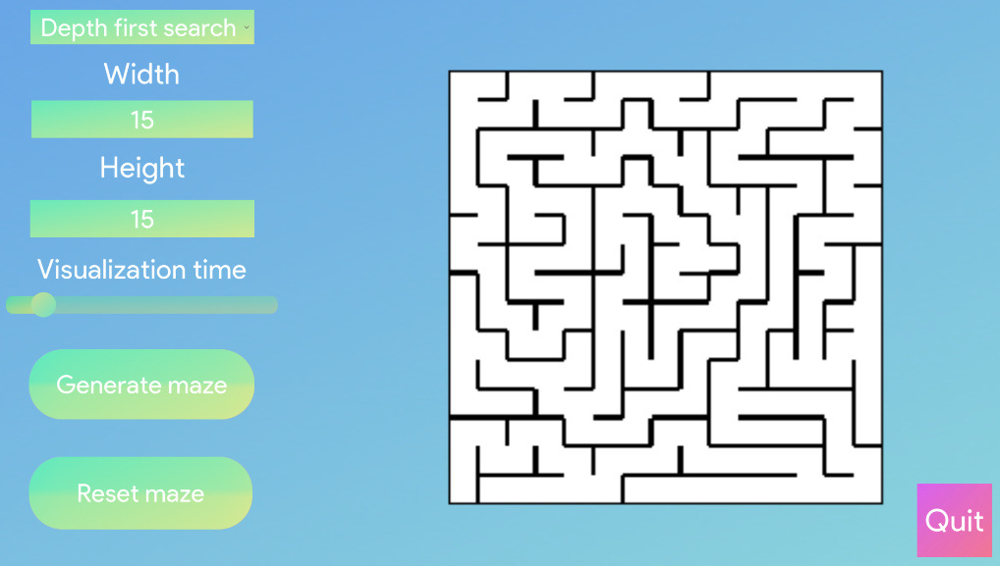
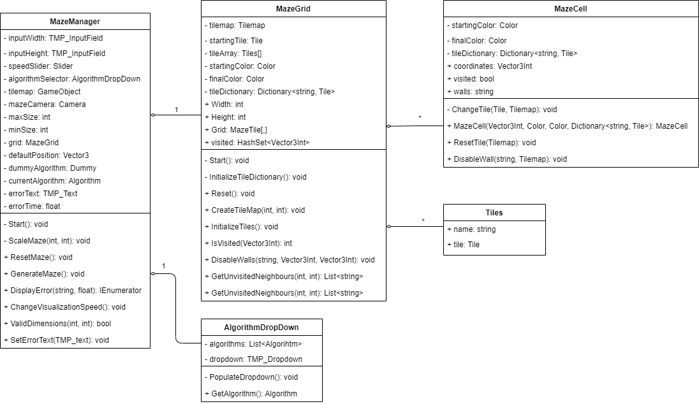
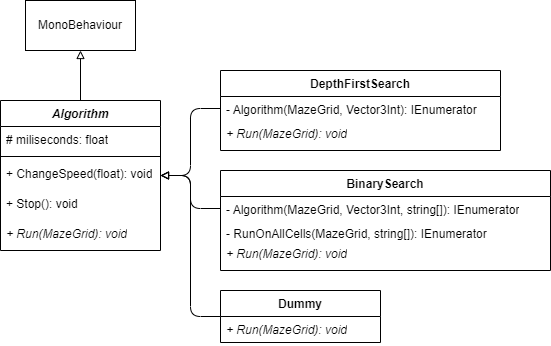
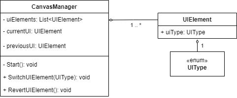

# Maze-inator
This repository contains the Unity project and source code for the Mazinator.
The game can be played by downloading the release [here](https://github.com/StefanStegeman/Maze-inator/releases).

# Table of Contents
1. [Installation](#install)
2. [Important components](#important-components)
    1. [Maze](#maze)
    2. [Algorithms](#algorithms)
    3. [CanvasManager](#canvasmanager)

# Install #
It is rather easy to install and open this Unity Project in the Unity Editor.
*Make sure you have atleast the Unity editor of 2020.3.23f1 or higher!*
1. Clone this Git repository.
2. In the UnityHub, click: **Add**
3. Select the folder **Mazinator** inside of the cloned repository.
4. Click on the newly added project **Mazinator** inside of the Unity Hub

# Important Components #
This project can be encapsulated by 3 important collections of components: 

## Maze ##
The maze is built up from 3 main components:
- The [MazeManager](https://github.com/StefanStegeman/Maze-inator/blob/main/Assets/Scripts/Managers/MazeManager.cs)
- The [MazeGrid](https://github.com/StefanStegeman/Maze-inator/blob/main/Assets/Scripts/Maze/MazeGrid.cs)
- The [MazeCell](https://github.com/StefanStegeman/Maze-inator/blob/main/Assets/Scripts/Maze/MazeCell.cs)

In order to select an [algorithm](#algorithms) to be used in the generation process, there needs to be an option to do so. This has been implemented with a drop down menu in the [AlgorithmDropDown](https://github.com/StefanStegeman/Maze-inator/blob/main/Assets/Scripts/UI/AlgorithmDropDown.cs) script.

## Algorithms ##
The maze is getting generated by algorithms. The following algorithms have been implemented:
- [Depth first search](https://en.wikipedia.org/wiki/Maze_generation_algorithm#Recursive_implementation)
- [Binary search](https://en.wikipedia.org/wiki/Maze_generation_algorithm#Simple_algorithms)

## CanvasManager ##
The [Canvas manager](https://github.com/StefanStegeman/Maze-inator/blob/main/Assets/Scripts/Managers/CanvasManager.cs) handles all UI actions. It contains a list of all [UIElements](https://github.com/StefanStegeman/Maze-inator/blob/main/Assets/Scripts/UI/UIElement.cs). Each UIElement contains a UIType which allows for quick and easy setup and management.

